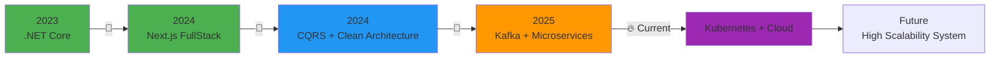

<div align="center">

# 🚀 Nguyễn Việt | FullStack Developer 🚀


</div>

---

<div align="center">

## 🌟 About Me 🌟

</div>

<table>
<tr>
<td width="50%" valign="top">

```javascript
const vietokeman = {
    name: "Nguyễn Việt",
    located_in: "Ho Chi Minh City 🇻🇳",
    education: "FPT University HCMC",
    current_role: "FullStack Developer",
    
    fields_of_interests: [
        "Web Development",
        "Microservices Architecture",
        "Cloud & DevOps",
        "Security & Performance",
        "Distributed System",
        "Messaging Broker (Kafka, RabbitMQ)"
    ],
    
    currently_learning: [
        "Kubernetes",
        "Kafka Deep Dive",
        "System Design",
        "High Availability Architecture"
    ],
    
    hobbies: ["Coding 💻", "Reading 📚", "Coffee ☕", "Automation ⚙️"]
};
```

</td>
<td width="50%" valign="top">


</td>
</tr>
</table>

<div align="left">

🔹 FullStack Developer thành thạo **ASP.NET Core** & **Next.js**  
🔹 Kinh nghiệm về **Microservices**, **CQRS**, **Event-driven**  
🔹 Nắm vững **JWT**, **OAuth2**, **RBAC**, **Clean Architecture**  
🔹 Xử lý bất đồng bộ & background jobs với **Hangfire**  
🔹 Security & scanning với **ClamAV**  
🔹 Message streaming & event queue với **Kafka**  
🔹 CI/CD, Docker, DevOps mindset  
🔹 DB: PostgreSQL • SQL Server • MySQL • MongoDB • Redis  

</div>

---

<div align="center">

## 💎 Tech Stack & Skills 💎

</div>

### 🎨 Frontend Development
<p align="center">
  
  
  
  
  
</p>

### ⚙️ Backend Development
<p align="center">
  
  
  
  
  
  
</p>

### 🗄️ Database & Caching
<p align="center">
  
  
  
  
  
</p>

### 🛠️ DevOps & Tools
<p align="center">
  
  
  
  
  
  
</p>

---

<div align="center">

## 📊 Contribution Graph 📊


</div>

---

<div align="center">

## 📈 GitHub Statistics 📈


</div>

<div align="center">
  
  
</div>

<div align="center">
  
</div>

<div align="center">
  
</div>

---

<div align="center">

## 🏆 GitHub Trophies 🏆


</div>

---

<div align="center">

## 🛣️ Learning Roadmap 🛣️

</div>



---

<div align="center">

## 💭 Dev Wisdom 💭


</div>

---

<div align="center">


## 🤝 Connect With Me 🤝

<a href="https://github.com/Vietokeman" target="_blank">
  
</a>
<a href="https://www.linkedin.com/in/vi%E1%BB%87t-nguy%E1%BB%85n-a8522b342/" target="_blank">
  
</a>
<a href="mailto:vietbmt19@gmail.com" target="_blank">
  
</a>
<a href="https://www.facebook.com/profile.php?id=100013090003202" target="_blank">
  
</a>

</div>

---

<div align="center">

## 💖 Thanks for visiting! 💖


*Show some ❤️ by starring my repositories!*


**Crafted with 💙 by Vietokeman**

</div>

<div align="center">


</div>
